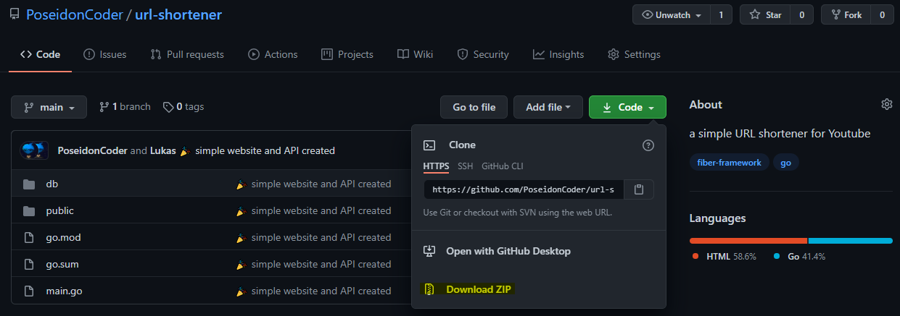

# URL-shortener in Go
### [view this project on Youtube](https://youtu.be/bQ-ciRZ5fVQ)

## How to clone this project

### git
For Git, type `git clone https://github.com PoseidonCoder/url-shortener.git` in the terminal

### github
* On Github, click the "code" button and a dropdown should appear
* click "download"

## Usage
* to download all packages, type `go get -u ./...` in the terminal
* navigate to [localhost:8080](http://localhost:8080) to see the result!